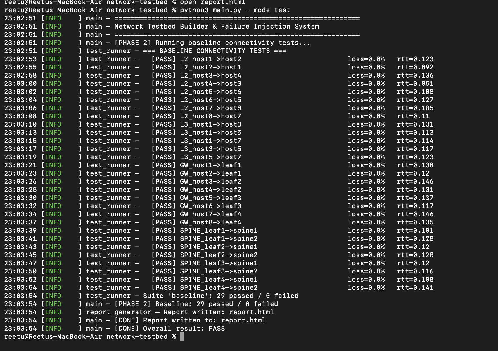
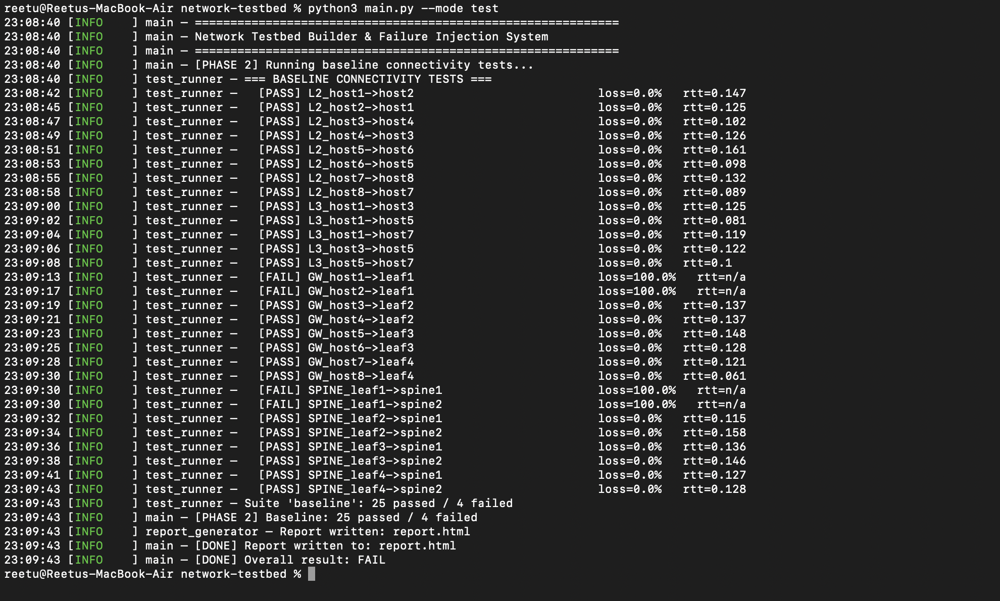
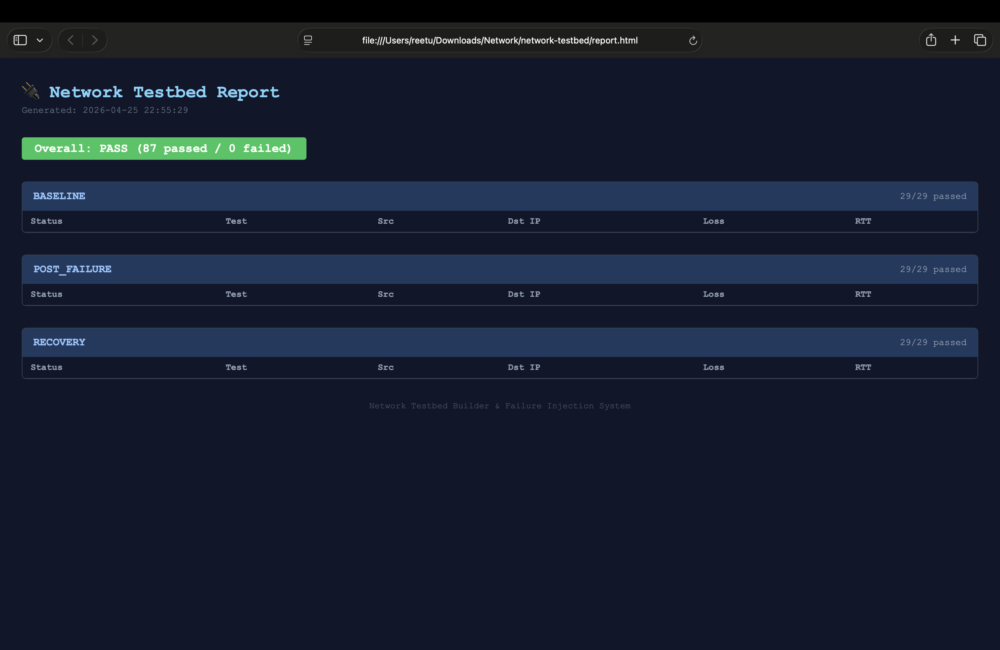

# Network Testbed Builder & Failure Injection System

A Docker-based network simulation system that builds a leaf-spine topology and performs automated connectivity testing with failure injection and recovery validation.

---

## 🚀 Features

* Docker-based leaf-spine topology (2 spines, 4 leaves, 8 hosts)
* Automated L2, L3, Gateway, and Spine connectivity testing
* Failure injection using container disruption
* Recovery validation after failures
* HTML report generation

---

## 🧱 Architecture

* 2 Spine nodes
* 4 Leaf nodes
* 8 Host nodes
* Single Docker bridge network

---

## ⚙️ Setup

```bash
git clone https://github.com/ReetuPailla/network-testbed-failure-injection.git
cd network-testbed-failure-injection
pip3 install -r requirements.txt
docker compose up -d --build
```

---

## ▶️ Run

### Baseline Test

```bash
python3 main.py --mode test
```

### Full Pipeline

```bash
python3 main.py --mode full
```

---

## 💥 Failure Simulation

```bash
docker stop leaf1
```

Re-run tests to observe failures.

Restore:

```bash
docker start leaf1
```

---
## 📸 Screenshots

### ✅ Baseline Test (All PASS)


### ❌ Failure Scenario (After Injection)


### 📊 HTML Report Dashboard


---

## 📊 Output

* Terminal logs (PASS / FAIL)
* HTML report (`report.html`)

---

## 🧠 Key Learnings

* Docker networking
* Distributed systems debugging
* Failure injection strategies
* Automated test validation

---

## ⚠️ Notes

* macOS restricts advanced network emulation (tc/netem)
* Failure simulation is done using container-level disruption

---

## 👩‍💻 Author

Reetu

